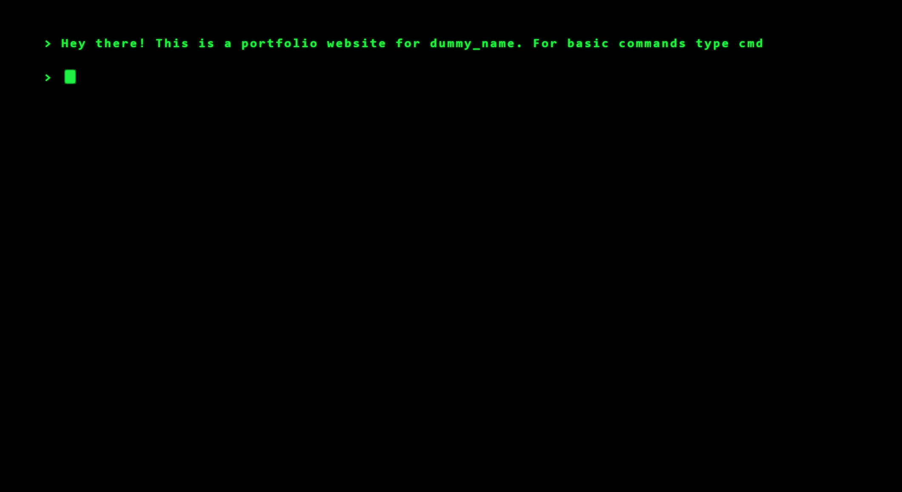

## React-terminal-portfolio  
Minimal Portfolio template for Developers built with React. Use it to showcase your work, testimonials and other information to clients.
If you like it give it a :star: 
## Preview

## Code

The code for this project is in the code-react-terminal branch. For deploying your react-app to GitHub pages follow this link - [Deploy-to-github-pages](https://reactgo.com/deploy-react-app-github-pages/)

## Installation

- Clone/Fork the repo.
- cd into the cloned repository
- Run `npm install`.
- Change the values in `src/components/cat.jsx` to suit your use-case.
- Run `npm start` to spin the up the local dev server port http://localhost:3000

## GitHub Pages

GitHub makes it easy to create personal websites. Follow this link - [GitHub Pages](https://pages.github.com/) to know how or follow the steps below.

If you already have a GitHub profile (obviously)

- Create a new repo with the name {username}.github.io
- Clone/Fork this repo and copy the files to your newly created repo
- Customize your name, links and everything else for your landing page
- git push

Voila! Your site should be live at https://{username}.github.io

Here's is a **dummy Landing Page** - [react portfolio](https://shloksomani.github.io/react-terminal-portfolio/)

## Todo
- Have the arrow functionality so that user can cycle through prev commands 
- Tab auto complete 
- Giving unique id's to list elements and removing the hard coded one 
- Change the theme on user commands  
- A card like structure for diffrent projects and education 

## Licence

MIT License © Shlok Somani
